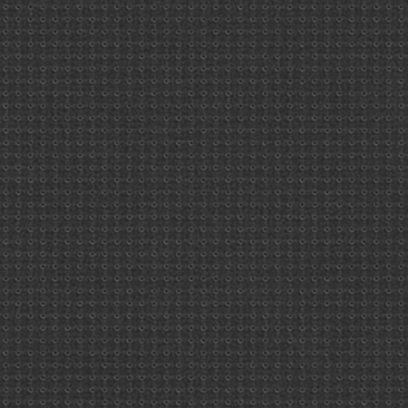
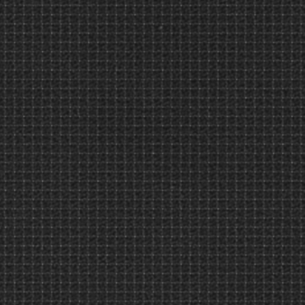

# Sensor Pattern Noise Filtration
 This program will extract the sensor pattern noise from an image.


Based on Digital Camera Identification from Sensor Pattern Noise by Jan Lukáš, Jessica Fridrich, and Miroslav Goljan

and

A context adaptive predictor of sensor pattern noise for camera source identification by Guangdong Wu, Xiangui Kang, and K. J. Ray Liu


To setup:

`python3 setup.py build_ext --inplace`

to run:

`cython filter_cy.py Your_path 512 512`

and to run without the cython optimization:

`python3 filter_cy.py Your_path 512 512`

Options are as follows:
```
Path - Required, just the path to a folder containing jpgs. 

height - in pixels, default 256

width - in pixels, default 256

--nocrop - will not crop the image. Will take substantially longer.
```

Requirements are numpy, PIL, matplotlib, cv2

theres also an average_image.py file in here which will average all the filtered images together to give a nice image of the pattern noise.

It will be hard to spot with one image, but it becomes very clear after ~100 images.

Here's an example of iphone noise:



Here's an example of samsung noise:




todo:

Add other file types than jpg.

Implement multiprocessing.

Optimize the filter to combat artifacts, overexposure etc.

Find a way to make the pattern clearer. Maybe boost the value of any pixels over x value.

Maybe port to C for better performance.

